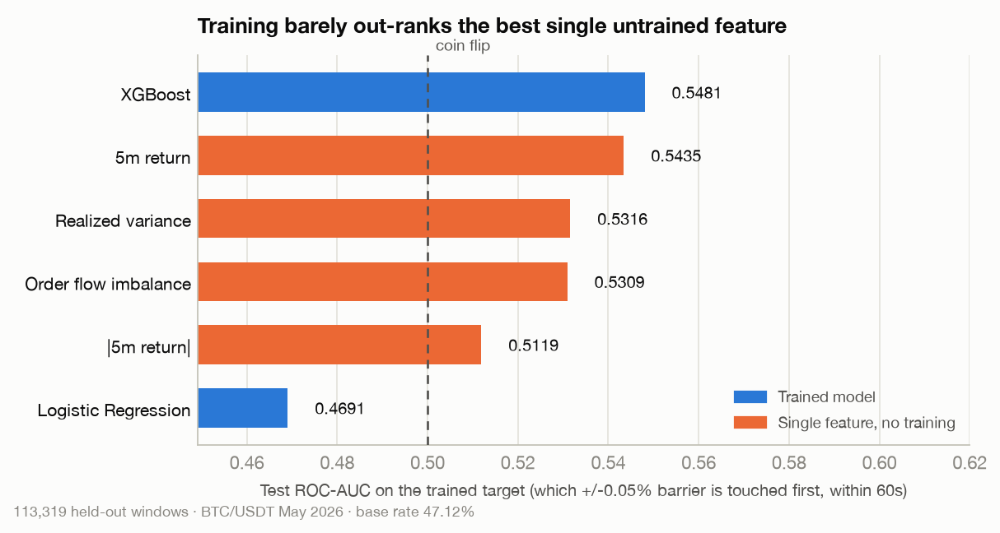
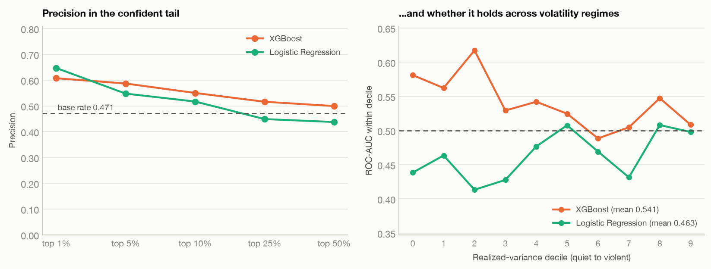

# BipowerQuant

**Can you predict which way Bitcoin moves in the next minute?**

This repository is an honest attempt at that question on a full month of tick-level
BTC/USDT data. It combines a C++20 jump-diffusion math engine, an out-of-core Polars
ingestion pipeline, and three models — Logistic Regression, XGBoost, and a PatchTST
Transformer — all solving the identical classification problem on the identical windows.

The short answer is: **a little, and not enough to trade yet.** The long answer — including
the labelling mistake that turned a 0.046 edge into an apparent 0.247 one, and how it was
caught — is below.

---

## 1. The problem

### An example

It is 14:32:00 on a Tuesday. Over the last five minutes BTC/USDT has traded about 8,000
times; the price drifted up 12 bp, there was one 30-BTC sell wall forty seconds ago, and the
tape has been quiet since. You have to decide, right now, whether to buy.

You are not asking "will the price be higher in a minute?" — that question is nearly a coin
flip and, worse, it is unprofitable even when you win. A round trip costs about **5 basis
points** in taker fees. A correct call that captures +1 bp still loses money.

The question that pays is: **starting now, does the price rise 5 bp before it falls 5 bp?**
If yes, you buy and exit at the profit target. If no, you would have been stopped out first.

That is the label this project predicts.

### Mathematically

Let $p_t$ be the log price at second $t$. Fix a barrier width $\theta$ and a deadline $H$.
From the decision time $t$, define the first-passage times

$$\tau^{+} = \min \lbrace k \le H : p_{t+k} - p_t > \log(1+\theta) \rbrace \qquad \tau^{-} = \min \lbrace k \le H : p_{t+k} - p_t < -\log(1+\theta) \rbrace$$

with $\min \emptyset = \infty$. The label is which barrier is reached first:

$$y_t = \begin{cases} 1 & \text{if } \tau^{+} < \tau^{-} \quad \text{(profit target hit first)} \\ 0 & \text{if } \tau^{-} < \tau^{+} \quad \text{(stop hit first)} \\ \text{undefined} & \text{otherwise: neither barrier reached within } H \end{cases}$$

This is **López de Prado's Triple-Barrier Method**: two horizontal barriers at
$\pm\theta$ and one vertical barrier at $H$. Here $\theta = 5\text{ bp} = 0.0005$ and
$H = 60$ seconds. The features are computed from the preceding $L = 300$ seconds.

The critical property is that **both classes require the same 5 bp move.** Magnitude is
constant across the label, so no amount of volatility forecasting can score above chance —
only getting the *sign* right can. Section 3 shows why that property is the entire point.

---

## 2. The dataset


The pipeline consumes raw Binance public trade data — one row per executed trade.

| | |
| :--- | ---: |
| Source | [Binance Vision: BTC/USDT spot trades](https://data.binance.vision/?prefix=data/spot/monthly/trades/BTCUSDT/) |
| File | `BTCUSDT-trades-2026-05.csv` (~1.5 GB zipped, **5.1 GB** raw) |
| Individual trades | **72,566,188** |
| Period | 31 days (May 2026) |
| Volume | 425,331 BTC |
| Price range | \$72,520.93 – \$82,840.42 |

**On the time scale.** The *input* is genuinely tick-level: 72.5 M individual trades, an
average of **28 trades per second**, with bursts past 400,000 trades an hour. The pipeline's
first step folds those ticks into **1-second bars** — the finest uniform grid on which a
5-minute lookback and a 60-second deadline are both well defined. So a "tick" in the raw
file is one trade; a "bar" in the model is one second, and the 300-step lookback is 5
minutes of wall clock, not 300 trades.

| | |
| :--- | ---: |
| 1-second bars | **2,678,400** |
| …carrying at least one trade | 2,284,821 |
| …carrying **none** | 393,579 (**14.7%**) |

That last row is why the bar grid is built the way it is. Roughly one second in seven has no
trade at all. A naive `group_by` emits no bar for those seconds, which silently makes a
"60-bar horizon" span an arbitrary 60–80 seconds of wall clock that varies with how busy the
market is — and under a triple barrier, where the deadline *is* the horizon, that would make
the label itself depend on activity. Every second in the period therefore gets a bar;
trade-less ones carry a forward-filled price, zero volume, and zero order flow.

### Windows and splits

Windows advance one second at a time, so consecutive windows share 299 of their 300 bars.
Of the 2,678,041 windows in the month:

| Outcome within 60 s | Windows | Share |
| :--- | ---: | ---: |
| Upper barrier first (`y = 1`) | 281,581 | 10.5% |
| Lower barrier first (`y = 0`) | 292,086 | 10.9% |
| **Neither — vertical barrier** | **2,104,374** | **78.6%** |

Most minutes go nowhere, so most windows carry no side and are dropped. What remains is
**573,667 labelled windows, near-perfectly balanced** — which is the trade the triple
barrier makes: a fifth of the data, in exchange for a label that volatility cannot fake.

Splits are chronological — 70% train / 10% validation / 20% test — with a **purge** of
$L + H - 1 = 359$ windows before each boundary. Without it the last training windows are
labelled by price moves that fall inside the next split's lookback. With it, the
information footprints of the two sides are disjoint by exactly one bar. The held-out test
block is **113,319 labelled windows** spanning the final 6.2 days.

---

## 3. Results

*BTC/USDT, May 2026. All models trained on the same 413,312 windows and scored on the same
113,319 held-out windows. Target: which ±5 bp barrier is touched first within 60 s. Base
rate 47.1%. Intervals are moving-block bootstrap, blocked at 360 windows so overlapping
windows are not counted as independent.*

| | Logistic Regression | XGBoost |
| :--- | ---: | ---: |
| Input | OFI only (1 scalar) | 7 stochastic features |
| Parameters | 2 | 100 trees, depth 4 |
| **ROC-AUC** | 0.4691 | **0.5462** |
| 95% CI | [0.4460, 0.4893] | [0.5262, 0.5652] |
| P(AUC ≤ 0.5) | 1.000 | 0.000 |
| Precision | 0.4370 | 0.5024 |
| Recall | 0.4201 | 0.4857 |
| F1 | 0.4284 | 0.4939 |
| Median latency | 0.002 ms | 0.045 ms |

> **PatchTST is not in this table yet.** It scored 0.7407 on the *old* target and its
> architecture has since changed (§5.3). Retraining it against the triple barrier needs a
> GPU session; §6 has the instructions, and the row is deliberately left empty rather than
> filled with a number measured against a different label.

**Accuracy is not reported.** With a 47% base rate it happens to be readable here, but it
was actively misleading under the old 7%-positive target — a model that never fires scored
0.93 — and leaving the column out is the safer habit. Read ROC-AUC and precision.

**What the number means.** XGBoost separates up-first from down-first windows at
**0.5462 ROC-AUC**, with the bootstrap excluding 0.5 in every one of 400 resamples. In
high-frequency finance 0.52–0.54 is the band usually called an edge, so this is real but
small. Its most confident calls do carry lift — the top 1% of predictions are 63.6% correct
against a 47.1% base rate, a **1.35×** lift — but no backtest with slippage and queue
position has been run, and 0.55 against a 5 bp cost bar is a long way from a strategy.



*(The figure reads XGBoost at 0.5481, the table at 0.5462. `make_figures.py` rebuilds the
seven features in NumPy so it can run without the compiled C++ engine, and differencing a
2.7-million-term cumulative sum to recover a 300-term window sum loses enough precision —
about 5e-8 relative — for XGBoost's split decisions to shift the third decimal. Both are deep
inside the ±0.02 interval. It is a fair calibration on how small this signal is that a
perturbation that size is visible in the result at all.)*

Order Flow Imbalance alone is *worse* than a coin flip (0.4691, and the bootstrap puts
P(AUC ≤ 0.5) at 1.000). That is not a broken model — it is a real and consistent effect:
over a 1-minute horizon, aggressive buying is followed by the *lower* barrier more often
than the upper one. Order flow at this horizon mean-reverts. Inverting the sign would give
0.53; it is left as-is because the point of the baseline is to report what raw OFI does, not
to fit a sign to the test set.

The trained models now edge past the best untrained single feature — the 5-minute return, at
0.5435 — instead of trailing it. That is a change of *sign* from every earlier version of
this project, but be careful how much weight it takes: the margin is **+0.003** for XGBoost
and +0.008 for a linear model on the same seven features, both comfortably inside the
bootstrap interval. The right reading is "training is no longer actively worse than a rolling
sum", not "training has been shown to help".

### Why the target was changed


An earlier version of this project reported **0.7469 ROC-AUC** and read it as a directional
result. It was not one, and this figure is why.

The old target was $y_t = 1$ if the forward 60-second return exceeded +5 bp. That is a
**compound event**: *a large move happened* **and** *it went up*. The first conjunct is much
easier to predict than the second, because volatility is strongly autocorrelated — so a
model optimising the compound drifts into forecasting magnitude and is scored as though it
had forecast direction.

The evidence is that a plain rolling sum of $r_t^2$ over the lookback — one line of NumPy,
no training, no parameters — scored **0.7464** on that target, statistically level with the
full 7-feature XGBoost (0.7469) and above the 118k-parameter Transformer (0.7407). The
reason is visible in the label rates: across realized-variance deciles on the old target,
the positive rate runs from **1.3%** in the quietest decile to **23.2%** in the most
violent. Ranking windows by volatility therefore ranks the label, with no directional skill
whatsoever.

Under the triple barrier the same rolling sum collapses to **0.5316**, because both of its
classes require the same 5 bp move. The 0.75 was never wrong as a number; it was a
well-measured volatility forecast wearing a direction forecast's label.

*(This was not data leakage. The splits were and are purged correctly — the information
footprints of adjacent splits are disjoint by construction, verified bar by bar on the full
month.)*

### Where the edge lives



Two checks that a single headline AUC hides. **Left:** precision rises monotonically with
confidence — the model's most certain calls really are its best ones, which is what makes a
ranking usable at all. (In an earlier 8-hour run this was *inverted*, the top 1% being the
worst predictions, so it is a genuine change and not just a larger sample.) **Right:** AUC
computed *within* each realized-variance decile, which asks whether the edge is an artefact
of one volatility regime. It is not — XGBoost stays above 0.5 in 9 of 10 deciles and averages
0.541 — though it is visibly stronger in quiet markets than violent ones.

---

## 4. The mathematical framework

The premise is that high-frequency log price does not follow a simple random walk but an
Itô jump-diffusion:

$$dp_t = \mu_t\,dt + \sigma_t\,dW_t + J_t\,dN_t$$

* $\mu_t\,dt$ — continuous drift
* $\sigma_t\,dW_t$ — Brownian diffusion, ordinary market volatility
* $J_t\,dN_t$ — a Poisson-driven jump component: block orders, liquidations, news

The value of this decomposition is that the diffusive and jump parts are *separately
estimable* from discrete data. Over a rolling window of $M$ one-second returns $r_{t,i}$:

**1. Realized Variance — total risk.** Absorbs both diffusion and jumps.

$$RV_t = \sum_{i=1}^{M} r_{t,i}^2$$

**2. Bipower Variation — continuous risk only.** Multiplying *adjacent* absolute returns
makes the estimator jump-robust: two consecutive ticks both containing a jump is a
vanishing-probability event, so the product terms are dominated by the diffusive part.

$$BPV_t = \frac{\pi}{2} \sum_{i=2}^{M} \lvert r_{t,i}\rvert\,\lvert r_{t,i-1}\rvert$$

**3. Jump component — discrete shocks.** The difference isolates the shock magnitude.

$$J_t = \max(RV_t - BPV_t,\ 0)$$

### Microstructure

**Order Flow Imbalance** uses the tick-level `is_buyer_maker` flag to measure net aggression.
A taker buying from a maker (`is_buyer_maker == False`) is aggressive buying; the reverse is
aggressive selling. OFI is the net signed volume over the window, netted at tick level
inside each second:

$$OFI_t = \sum_{i=1}^{M} q_i \cdot s_i \qquad \text{where} \qquad s_i = \begin{cases} +1 & \text{if is buyer maker is False (aggressive buy)} \\ -1 & \text{if is buyer maker is True (aggressive sell)} \end{cases}$$

### Contextual features

$BPV_t$ and $J_t$ are non-negative magnitudes and therefore direction-blind, and a given OFI
means something different in a calm window than in a violent one. Three derived features
restore that context:

| Feature | Definition | What it adds |
| :--- | :--- | :--- |
| Lookback return | $r_{t-5\text{m}} = p_t - p_{t-300}$ | the trend the shock arrived in |
| Vol-adjusted OFI | $OFI_t / (\sqrt{BPV_t} + \epsilon)$ | order flow per unit of risk |
| Signed jumps | $J_t \cdot \operatorname{sign}(r_{t-5\text{m}})$ | shock into an up- vs down-trend |

with $\epsilon = 10^{-8}$ guarding flat windows. These seven numbers — $RV$, $BPV$, $J$,
$OFI$, and the three above — are the full input to the Logistic Regression and XGBoost.

---

## 5. The models

All three solve the identical problem: same bars, same windows, same purged splits, same
triple-barrier labels. They differ only in what they read.

### 5.1 Logistic Regression — the control

One feature, OFI, two parameters. Not a contender; it exists so the gap between it and
XGBoost measures what the jump-diffusion features actually bought. Pass `--all-features` to
give it all seven, which separates "the extra inputs helped" from "the non-linearity
helped": on this data it reaches 0.5512, statistically indistinguishable from XGBoost's
0.5462, meaning almost all of the tree model's edge is in the *features*, not the trees.

### 5.2 XGBoost — the workhorse

100 trees, depth 4, learning rate 0.05, on the seven-feature matrix. `scale_pos_weight` is
recomputed from the training split at every run rather than assumed — it lands at 1.02
under the triple barrier, but was 12.19 under the old target, and the code should not care
which.

### 5.3 PatchTST — the sequence model

The tabular models see **seven numbers per window**, and every one of them is a *sum* over
the lookback. A sum is order-blind: a window where a 40-BTC sell wall hit in the first ten
seconds and one where it hit in the last ten produce identical feature vectors, even though
only the second is still moving the book at decision time.

[PatchTST](https://arxiv.org/abs/2211.14730) (Nie et al., ICLR 2023) is a Transformer for
time series that recovers that ordering. Three things about the configuration here:

**Patching.** The 300-bar lookback is cut into overlapping patches of $P = 16$ bars at
stride $S = 8$, giving $N = \lfloor (300-16)/8 \rfloor + 2 = 37$ tokens instead of 300. A
single second carries about as much meaning as a single character does in a sentence;
patches carry sub-series with local semantics, and attention cost drops by ~66×.

**Two raw channels.** The model reads `log_return` and `ofi` — the two primitive observables
— as channel-independent univariate series sharing one set of encoder weights. Earlier
versions also fed in $r_t^2$, $\frac{\pi}{2}|r_t||r_{t-1}|$, log volume and log trade count,
but those are pointwise functions of the first two and can be formed in the first layer, so
supplying them spends channel width to buy nothing. The saved budget goes into **depth: 6
encoder layers instead of 3**, for 209,029 parameters.

**A classification head.** The paper's `Flatten + Linear → T future values` becomes
`Flatten + Linear → 1 logit`, trained with `BCEWithLogitsLoss(pos_weight=n⁻/n⁺)`. Instance
normalisation is applied per window and channel, which is what lets the model survive
regime shifts — but it also deletes *how* volatile the window was, so the discarded
per-channel mean and log-std are standardised and concatenated back into the head.

---

## 6. Getting started

### Install

```bash
git clone https://github.com/NynsenFaber/BipowerQuant.git
cd BipowerQuant
uv sync                       # or: pip install polars numpy scikit-learn xgboost torch matplotlib
./build.sh                    # compiles the C++ engine into bipower_core
```

`build.sh` needs CMake and a C++20 compiler. Only `ml_matrix.py` and the two tabular
trainers import `bipower_core`; the PatchTST pipeline is pure Polars + NumPy + PyTorch and
runs without it, which is what lets the same code run in a Colab runtime.

### Get the data

Download `BTCUSDT-trades-2026-05.zip` from the
[Binance archive](https://data.binance.vision/?prefix=data/spot/monthly/trades/BTCUSDT/),
unzip it into `data/`, and point `FILE_PATH` in [python/data_feeder.py](python/data_feeder.py)
at it if you use a different name or month.

### Run the baselines

The first run streams 72 M ticks into 1-second bars (~35 s) and caches them, so every later
run starts instantly:

```bash
cd python
python train_baseline.py --bars-cache ../data/bars_full.npz                  # OFI only
python train_baseline.py --bars-cache ../data/bars_full.npz --all-features   # all seven
python train_xgboost.py  --bars-cache ../data/bars_full.npz
```

Each prints ROC-AUC with a bootstrap interval, precision against the base rate, and appends
a timestamped row to `python/training_logs.txt`. Useful flags:

| Flag | Purpose |
| :--- | :--- |
| `--hours 8` | use the first 8 hours only — a fast pipeline check |
| `--label-mode fee_threshold` | restore the old `return > +5bp` target |
| `--no-log` | do not append to `training_logs.txt` |

A cache is only reused when it holds *exactly* the slice you asked for, so combining
`--hours 8` with a full-month `--bars-cache` is an error rather than a silent full-month run
reported under an 8-hour label. Use `--hours 8` on its own, or give it its own cache file.

Use 8 hours to check the pipeline, never to draw a conclusion: its test block holds about 16
independent episodes, and the bootstrap interval comes out at roughly [0.34, 0.79] against
the month's [0.53, 0.57].

### Train PatchTST

Training happens on a free Colab GPU; scoring happens locally against the exported
checkpoint.

1. **Push your branch.** The notebook clones this repository rather than carrying a copy of
   the model code, so whatever branch holds `python/patchtst_model.py` must exist on your
   remote. (No remote? The notebook's markdown documents uploading the four Python files
   through the Colab file browser instead.)
2. **Open [notebooks/train_patchtst_colab.ipynb](notebooks/train_patchtst_colab.ipynb) in
   Colab.** Set *Runtime → Change runtime type → T4 GPU*, then *Runtime → Run all*. It is
   configured for the full month and pauses once, at the start, for Drive authorisation —
   set `USE_DRIVE = False` to remove even that, at the cost of losing the cache if the
   runtime disconnects. The notebook downloads the Binance archive itself; nothing is
   uploaded.
3. **Bring the weights home.** The last cell triggers a browser download of a ~0.9 MB `.pt`.
   Move it into `weights/`.

Cell 6 is a throughput probe that times real training steps and estimates the epoch cost
*before* you commit a session to it. `HOURS = 8.0` gives a fast sanity run; `HOURS = None`
gives the month, which is what any conclusion needs — an 8-hour test split holds only about
16 independent episodes.

### Score it locally

```bash
cd python
python eval_patchtst.py --weights ../weights/<your-file>.pt \
                        --bars-cache ../data/bars_full.npz
```

The checkpoint carries its own data recipe — source file, bar count, window, horizon,
barrier width, label mode, channel layout, split fractions and sizes. `eval_patchtst.py`
rebuilds that exact window population from your local CSV and **refuses to score if it
cannot reproduce it**, rather than quietly reporting a number against a different
population. Pass `--allow-mismatch` if you know why they differ.

| Flag | Purpose |
| :--- | :--- |
| `--device mps` | Apple Silicon GPU (verified identical to CPU) |
| `--split val` | score the validation split instead |
| `--threshold 0.6` | change the probability cut-off for the hard label |
| `--save-predictions probs.npy` | dump per-window probabilities |

### Regenerate the figures

```bash
cd python
python make_figures.py --bars-cache ../data/bars_full.npz \
                       --scores-cache ../data/scores.json
```

Every plotted number is recomputed from the held-out split at render time — including the
figure titles, which are chosen from the data — so a figure cannot drift out of sync with
the result it illustrates. `--scores-cache` stores the scored metrics so restyling does not
re-run inference over 113k windows; delete it to force a rescore. Add
`--weights ../weights/<file>.pt` to include PatchTST; without it the tabular models are
drawn alone.

### Benchmark inference cost

```bash
cd python
python benchmark_inference.py --weights ../weights/<your-file>.pt \
                              --bars-cache ../data/bars_full.npz
```

Measured on Apple Silicon, one thread per model, 113,319 windows:

| Model | Single window (median) | p99 | Batched, per window | Windows/s |
| :--- | ---: | ---: | ---: | ---: |
| Logistic Regression (NumPy) | 0.002 ms | 0.003 ms | 0.01 µs | 143,717,617 |
| XGBoost (`inplace_predict`) | 0.045 ms | 0.276 ms | 0.55 µs | 1,807,257 |
| PatchTST (CPU, 209k params) | 0.934 ms | 1.035 ms | 423.33 µs | 2,362 |

Two numbers because they answer different questions: single-window latency is the *trading*
number — what a signal costs when a window closes and you must decide before the next tick —
and batched throughput is the *research* number, what a backtest over a month costs. Every
CPU model is pinned to one thread so the comparison measures models rather than core counts.
The tabular models additionally pay a feature-preparation step (300 bars → 7 scalars) of
0.0027 ms per window that PatchTST does not; even after adding it, XGBoost is ~20× faster at
batch 1 and ~770× faster batched.

> **macOS note.** torch and xgboost ship separate OpenMP runtimes and mixing them in one
> process either segfaults or deadlocks. Both halves of the mitigation are load-bearing:
> **import xgboost before torch**, *and* call `torch.set_num_threads(1)`. Getting only the
> first half right deadlocks inside torch's first tensor copy with no error and no CPU
> usage, so it looks exactly like a slow job. `benchmark_inference.py` and `make_figures.py`
> are the two scripts that mix both libraries; both do this, and both raise with
> instructions if torch was imported first. Linux, including Colab, is unaffected.

---

## 7. Technology

| Component | Technology | Role |
| :--- | :--- | :--- |
| Data ingestion | Polars (lazy/streaming) | folds 72 M ticks into 2.7 M bars in one pass, flat memory |
| Math engine | C++20 + `pybind11` | rolling $RV$, $BPV$, jumps and OFI over raw NumPy buffers, no copies |
| Tabular models | XGBoost, scikit-learn | the seven-feature classifier and the OFI control |
| Sequence model | PyTorch | PatchTST, trained on a Colab GPU, scored locally from a checkpoint |

Two efficiency notes worth knowing before reading the code:

* **Windows are never materialised.** Consecutive windows share 299 of 300 bars, so a
  materialised training tensor would cost `n_windows × M × 300` float32s. The `(M, n_bars)`
  channel matrix instead lives on the device once — ~21 MB for a month at two channels — and
  every batch is a single gather. No `DataLoader`, no per-batch host-to-device copies.
* **The triple barrier is vectorised.** Labelling 2.7 M bars naively means 160 M
  first-passage comparisons; here it is $H$ vectorised passes over the series, a few seconds
  instead of hours.

---

## 8. What is and is not established

**Established.** On a full month of BTC/USDT, a 7-feature jump-diffusion matrix separates
up-first from down-first 60-second outcomes at ~0.55 ROC-AUC, with a bootstrap interval that
excludes 0.5 comfortably. Most of that comes from the features rather than the model class:
a linear model on the same seven features matches the gradient-boosted trees.

**Not established.** That this is tradeable. A 0.55 AUC and a 1.35× lift in the confident
tail are not a strategy — what is missing is a backtest with slippage and queue position
reporting Sharpe on the flagged windows, not AUC over all of them. It is entirely possible
that 0.55 does not clear 5 bp.

**Not yet measured.** Whether reading the *sequence* beats reading the aggregates. PatchTST
has not been retrained against the triple-barrier target; that is the open question this
repository was built to answer.

**A caveat on the population.** The model is trained and scored only on windows where a
barrier is touched, which is not knowable in advance. In deployment that means either
accepting positions that close at the vertical barrier, or gating with a separate volatility
model to decide *whether* to trade while this one decides *which way* — the second is
López de Prado's meta-labelling, and this project already has a volatility forecast that
scores 0.75 for the gate.

**A caveat on the sample.** Everything here is one month of one instrument. Walk-forward
validation across several months is the check that has not been run.

---

## Appendix: metrics

**ROC-AUC** — the probability that a randomly chosen positive window is ranked above a
randomly chosen negative one, across all thresholds. 0.5 is a coin flip; 1.0 is perfect.
This is the headline metric because it does not depend on where the decision cut is placed.
In high-frequency finance, consistently above 0.52–0.54 is generally considered a real edge.

$$\text{AUC} = \int_0^1 \text{TPR}\,d(\text{FPR}), \qquad \text{TPR} = \frac{TP}{TP+FN}, \quad \text{FPR} = \frac{FP}{FP+TN}$$

**Precision** — of the windows the model flagged, how many were right. Always read against
the base rate: precision of 0.50 is skill when the base rate is 0.07 and worthless when it
is 0.50.

$$\text{Precision} = \frac{TP}{TP+FP}$$

**Recall** — of the windows that were positive, how many the model caught.

$$\text{Recall} = \frac{TP}{TP+FN}$$

**F1** — their harmonic mean, which penalises trading one for the other.

$$F_1 = 2\cdot\frac{\text{Precision}\cdot\text{Recall}}{\text{Precision}+\text{Recall}}$$

**Bootstrap intervals.** All confidence intervals here come from a *moving-block* bootstrap
with a block length of $L + H = 360$ windows. An i.i.d. bootstrap would be wrong and
flatteringly so: consecutive windows share 299 of 300 bars and their labels come from
overlapping forward paths, so resampling single windows treats hundreds of correlated
observations as independent and returns an interval several times too narrow.
