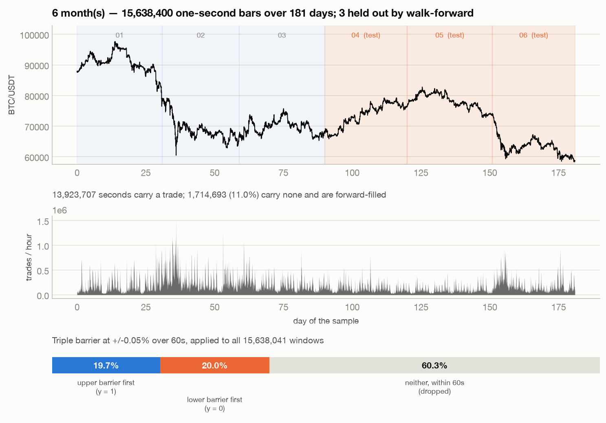
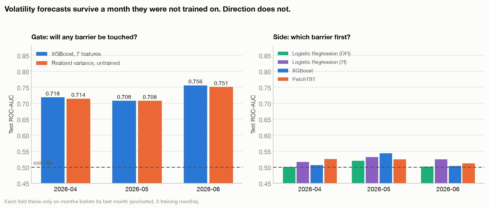
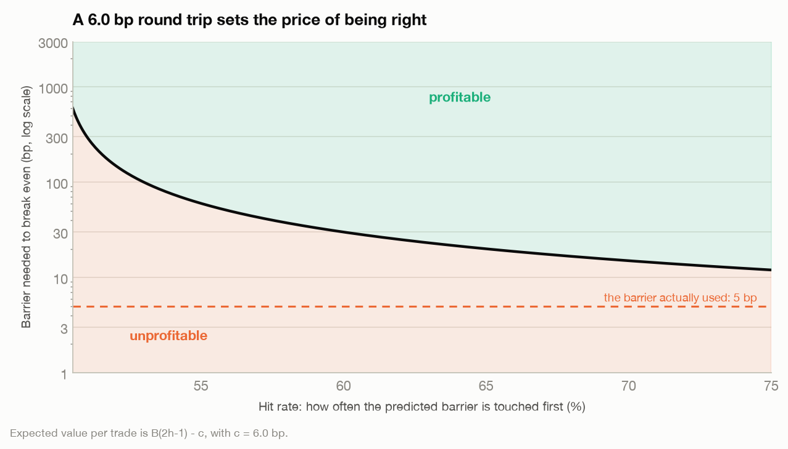
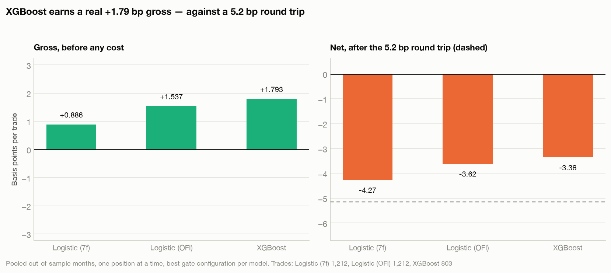
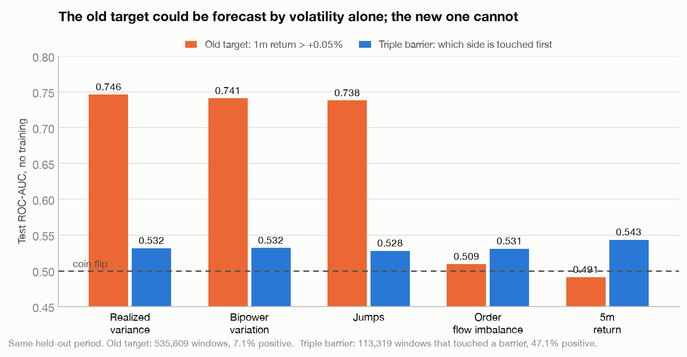

# BipowerQuant

[](https://github.com/NynsenFaber/BipowerQuant/actions/workflows/ci.yml)
[](https://codecov.io/gh/NynsenFaber/BipowerQuant)
[](https://www.python.org/downloads/)
[](https://github.com/astral-sh/ruff)

> If you find some nomenclature obscure, at the end you can find an appendix containing some definitions.

**Can you predict which way Bitcoin moves in the next minute?**

This repository is an honest attempt at that question on **six months of tick-level BTC/USDT
data** — 742 million trades. It combines a C++20 jump-diffusion math engine, an out-of-core
Polars ingestion pipeline, three models (Logistic Regression, XGBoost, PatchTST), walk-forward
validation across months, and a backtest with fees, slippage and FIFO queue position.

**The answer is no**, and the interesting part is how thoroughly no:

* Out of sample the tabular directional models score **0.51 ROC-AUC** and their gross P&L
  before any cost is **0.000 bp per trade**. A sequence model (PatchTST) does better, **0.55–
  0.58**, a real edge by this project's own bar — real, but nowhere near enough: even a side
  model right 100% of the time can't clear this target's cost (next point).
* The 5 bp profit target was set to one taker round trip, which is **6 bp**. A predictor told
  the correct answer in advance still loses money. The target was defined below its own cost. (WHY SETTING A TARGET SMALLER THAN THE FEE?)
* What *does* work, robustly and across every month tested, is the thing the project treated
  as a nuisance: forecasting **whether** a move happens at all, at **0.78 ROC-AUC** — matched
  to within 0.005 by a single rolling sum with no parameters.

Everything below is the evidence for those three claims, and the machinery that produced it.

---

## 1. The problem

### An example

It is 14:32:00 on a Tuesday. Over the last five minutes BTC/USDT has traded about 14,000
times; the price drifted up 12 bp, there was one 30-BTC sell wall forty seconds ago, and the
tape has been quiet since. You have to decide, right now, whether to buy.

You are not asking "will the price be higher in a minute?" — that question is nearly a coin
flip and, worse, it is unprofitable even when you win. A round trip costs about **5 basis
points** in taker fees. A correct call that captures +1 bp still loses money.

The question that pays is: **starting now, does the price rise 5 bp before it falls 5 bp?**
If yes, you buy and exit at the profit target. If no, you would have been stopped out first.

That is the label this project predicts.

### Mathematically

We treat this problem as binary classification. Here we describe how to get the labels.

Let $p_t$ be the log price at second $t$. Fix a barrier width $\theta$ and a deadline $H$.
From the decision time $t$, define the first-passage times

$$\tau^{+} = \min \lbrace k \le H : p_{t+k} - p_t > \log(1+\theta) \rbrace \qquad \tau^{-} = \min \lbrace k \le H : p_{t+k} - p_t < -\log(1+\theta) \rbrace$$

with $\min \emptyset = \infty$. The label is which barrier is reached first:

$$y_t = \begin{cases} 1 & \text{if } \tau^{+} < \tau^{-} \quad \text{(profit target hit first)} \\ 0 & \text{if } \tau^{-} < \tau^{+} \quad \text{(stop hit first)} \\ \text{undefined} & \text{otherwise: neither barrier reached within } H \end{cases}$$

This is **López de Prado's Triple-Barrier Method**: two horizontal barriers at
$\pm\theta$ and one vertical barrier at $H$. Here $\theta = 5\text{ bp} = 0.0005$ and
$H = 60$ seconds. The features are computed from the preceding $L = 300$ seconds.

The critical property is that **both classes require the same 5 bp move.** Magnitude is
constant across the label, so no amount of volatility forecasting can score above chance —
only getting the *sign* right can. Section 3 shows why that property is the entire point.

---

## 2. The dataset



The pipeline consumes raw Binance public trade data — one row per executed trade.

| | |
| :--- | ---: |
| Source | [Binance Vision: BTC/USDT spot trades](https://data.binance.vision/?prefix=data/spot/monthly/trades/BTCUSDT/) |
| Files | `BTCUSDT-trades-2026-01` … `2026-06` (~15 GB zipped, **52 GB** raw) |
| Period | **181 days**, January–June 2026 |
| Individual trades | **742,244,193** |
| Volume | 3,566,529 BTC |
| Price range | \$58,130 – \$97,924 |

**On the time scale.** The *input* is genuinely tick-level: 742 M individual trades, an
average of **47 trades per second**, with bursts past 400,000 trades an hour. The pipeline's
first step folds those ticks into **1-second bars** — the finest uniform grid on which a
5-minute lookback and a 60-second deadline are both well defined. So a "tick" in the raw
file is one trade; a "bar" in the model is one second, and the 300-step lookback is 5
minutes of wall clock, not 300 trades.

| | |
| :--- | ---: |
| 1-second bars | **15,638,400** |
| …carrying at least one trade | 13,923,707 |
| …carrying **none** | 1,714,693 (**11.0%**) |

That last row is why the bar grid is built the way it is. Roughly one second in nine has no
trade at all — and in the quietest month it is one in seven. A naive `group_by` emits no bar for those seconds, which silently makes a
"60-bar horizon" span an arbitrary 60–80 seconds of wall clock that varies with how busy the
market is — and under a triple barrier, where the deadline *is* the horizon, that would make
the label itself depend on activity. Every second in the period therefore gets a bar;
trade-less ones carry a forward-filled price, zero volume, and zero order flow.

### Windows, labels and splits

Windows advance one second at a time, so consecutive windows share 299 of their 300 bars.
Across the 15,638,041 windows in the six months:

| Outcome within 60 s | Windows | Share |
| :--- | ---: | ---: |
| Upper barrier first (`y = 1`) | 3,078,499 | 19.7% |
| Lower barrier first (`y = 0`) | 3,129,242 | 20.0% |
| **Neither — vertical barrier** | **9,430,300** | **60.3%** |

Most minutes go nowhere, so most windows carry no side and are dropped from the side model's
training set. What remains is 6.2 M labelled windows, near-perfectly balanced — the trade the
triple barrier makes: two-fifths of the data, for a label volatility cannot fake.

That headline hides the thing six months of data is for: the rate is not stable.

| Test month | Barrier touched within 60 s |
| :--- | ---: |
| April | 32.8% |
| May | 21.4% |
| June | 46.4% |

June is more than twice as tradeable as May. Any statistic estimated on one month —
including every number in this project's earlier single-month study — is an estimate of that
month's regime, not of the market.

**Splits are walk-forward, by calendar month.** Each fold trains only on months strictly
before its test month and is scored on that month alone, so every reported number is a
genuine forecast:

| Fold | Trains on | Tests on |
| :--- | :--- | :--- |
| 1 | Jan–Mar | April |
| 2 | Jan–Apr | May |
| 3 | Jan–May | June |

Within each fold a **purge** of $L + H - 1 = 359$ windows sits before the boundary. Without
it the last training windows are labelled by price moves that fall inside the test month's
first lookback; with it the information footprints of the two sides are disjoint by exactly
one bar.

---

## 3. Results

Two questions, in the order that matters. Does the model work on a month it has never
seen? And does what it finds survive contact with trading costs?

The answers are **partly** and **no**.

### 3.1 What transfers across months



The problem splits into two predictions, and they behave completely differently
out of sample.

**The gate — "will *any* barrier be touched in the next 60 seconds?"** This is the
volatility question. It transfers cleanly:

| Test month | XGBoost, 7 features | Realized variance, untrained |
| :--- | ---: | ---: |
| April | 0.7801 | 0.7748 |
| May | 0.7777 | 0.7728 |
| June | 0.8023 | 0.7977 |

Stable at ~0.78–0.80 across three months of very different character. Note the second
column: a plain rolling sum of $r_t^2$, with no training and no parameters, is within
**0.005** of the gradient-boosted trees every single time. The jump-diffusion feature set
is a good volatility estimator, and that is all it is — which is what $RV$ and $BPV$ were
designed to be.

**The side — "which barrier first?"** This is the directional question, and for the tabular
models it does not transfer:

| Test month | Logistic (OFI) | Logistic (7 features) | XGBoost | PatchTST |
| :--- | ---: | ---: | ---: | ---: |
| April | 0.5035 | 0.5053 | 0.5104 | 0.5477 |
| May | 0.4957 | 0.4865 | **0.5332** | **0.5847** |
| June | 0.5087 | 0.5090 | 0.5107 | 0.5564 |

The tabular models sit between 0.49 and 0.53, with the linear model dipping below a coin
flip in May. For comparison, the earlier single-month study — training on May's first 70%
and testing on May's last 20% — reported **0.5462** for the same XGBoost. Train on
Jan–April instead and test on all of May and it gives 0.5332; on April and June it gives
0.510.

**That gap is the entire value of adding five months of data**, for a model built on a
feature vector that sums over the lookback. A 0.55 measured inside one month was not a lie,
but it was mostly that month, and the honest out-of-sample figure for that class of model
is 0.51.

**PatchTST does not fit that pattern.** It beats every tabular side model in every fold —
by 0.0373 in April, 0.0515 in May, 0.0457 in June — and clears the 0.52–0.54 line this project
otherwise treats as the boundary of a real edge (Appendix) on all three months, not just the
one a single-month study happened to land on. §5.3 and §8 go into why an order-sensitive
model finds something a sum cannot, and why "real" here still does not mean "tradeable."

### 3.2 Trading a population you can actually select

The side model is trained only on windows where a barrier is touched — but *whether* a
barrier will be touched is not knowable when the decision is made. Reporting its accuracy on
that subset silently conditions on the outcome, and no amount of walk-forward fixes it: the
population itself is chosen with hindsight.

The fix is **meta-labelling**, with the two predictions given different jobs:

| | Question | Target | Trained on |
| :--- | :--- | :--- | :--- |
| **Gate** | is this window worth trading at all? | was *either* barrier touched? | every window |
| **Side** | which way? | which barrier came first? | windows where one did |

At decision time both produce a number from past data alone. A trade is taken when the gate
clears its threshold, in the direction the side model gives. The traded population is
therefore selected by a *prediction* rather than by an *outcome* — and the backtest scores
every window that selection admits, including the ones where the gate turns out to be wrong
and the position is closed by the clock at whatever price is available.

The threshold itself is a quantile of the **training** months' gate scores, not the test
month's. Taking "the top 10% of this month" would require that month's score distribution in
advance; the difference is small, because those distributions are stable, but a study whose
entire subject is selecting a population honestly should not import the answer through the
threshold.

This is López de Prado's construction with the roles assigned to fit the problem: his
primary model gives the side and a secondary model sizes the bet; here the volatility
forecast, which is the part that actually works, decides *whether*, and the weak directional
model only decides *which way*.

Two gates are compared throughout, and the comparison is the point: the trained XGBoost gate,
and realized variance thresholded at a percentile. As the table above shows, the second is
within 0.005 of the first — so the honest architecture is the rolling sum.

### 3.3 The backtest



Before any model: a position that wins captures the barrier $B$ and one that loses gives
back $B$, so with hit rate $h$ and round-trip cost $c$ the expectation per trade is

$$\mathbb{E}[\text{P\&L}] = B\,(2h - 1) - c$$

which is positive only when $B > c / (2h-1)$. On this instrument $c$ is **6.0 bp**: 2.5 bp
taker fee each side, 0.5 bp slippage each side, and a spread that rounds to nothing (BTC/USDT
quotes one tick, \$0.01, which across this sample's \$58k–\$98k range is **0.001–0.002 bp** —
three orders of magnitude below the fee, and too small for the Roll estimator to resolve
against 1-second return noise at all).

**The barrier this project has been using is 5 bp, against a 6 bp round trip.** A perfect
predictor loses money. That is not a modelling failure, it is arithmetic — and simulating an
oracle that is told the true side confirms it exactly:

| | Gross per trade | Cost | Net |
| :--- | ---: | ---: | ---: |
| **Oracle** (100% hit rate) | +5.943 bp | 6.001 bp | **−0.058 bp** |
| Coin flip | −0.030 bp | 6.001 bp | −6.031 bp |

At the measured out-of-sample hit rate the requirement is far out of reach: 0.51 needs a
**300 bp** barrier, 0.55 needs 60 bp, and even 0.65 needs 20 bp.



The full walk-forward backtest, pooled across the three out-of-sample months, with one
position at a time:

| Model | Gate | Trades | Gross/trade | Net/trade | Sharpe | 95% CI |
| :--- | :--- | ---: | ---: | ---: | ---: | :--- |
| XGBoost | RV, top 10% | 35,341 | −0.001 bp | −6.002 bp | −15.19 | [−26.07, −12.12] |
| Logistic (7f) | RV, top 10% | 35,341 | +0.012 bp | −5.990 bp | −15.31 | [−26.12, −12.22] |
| XGBoost | XGBoost, top 20% | 58,177 | −0.007 bp | −6.008 bp | −18.60 | [−29.76, −14.79] |
| XGBoost | RV, top 50% | 107,913 | +0.006 bp | −5.996 bp | −28.44 | [−37.28, −23.57] |
| XGBoost | none | 173,445 | +0.003 bp | −5.999 bp | −61.63 | [−96.70, −47.84] |

Read the **gross** column, because it is the one that does not depend on the cost
assumptions. It is zero. Not small — zero, to three decimal places, for every model and
every gate. The strategies do not lose to fees; they capture nothing to pay fees with.

Gating helps only in the sense that trading less loses less. The Sharpe improves from −62 to
−15 purely because a tenth as many round trips are paid for.

**Positions never overlap.** Windows advance every second, so a backtest that opens a
position on every flagged window would count the same price move hundreds of times and
report a Sharpe inflated by roughly the square root of that overlap. Signals arriving while
a position is already open are dropped, and in the ungated run the overwhelming majority
are: millions of flagged windows collapse to 173,445 actual trades. Any backtest of this
strategy that skips that step is wrong by a large factor, in the flattering direction.

### 3.4 Why the target was defined this way



*(This figure is the historical record of the target change: May 2026 only, chronological
70/10/20 split, which is the study it was drawn from. The point it makes is definitional
rather than a claim about generalisation — regenerate it on any period with
`make_figures.py` and the shape is the same.)*

An earlier version of this project reported **0.7469 ROC-AUC** and read it as a directional
result. It was not one, and this figure is why the target was rewritten.

The old target was $y_t = 1$ if the forward 60-second return exceeded +5 bp. That is a
**compound event**: *a large move happened* **and** *it went up*. The first conjunct is far
easier to predict than the second, because volatility is strongly autocorrelated — so a
model optimising the compound drifts into forecasting magnitude while being scored as though
it had forecast direction.

The evidence is that a plain rolling sum of $r_t^2$ over the lookback — one line of NumPy, no
training, no parameters — scores **0.7464** on that target, statistically level with the full
7-feature XGBoost and above a 118k-parameter Transformer. Under the triple barrier the same
rolling sum collapses to **0.5316**, because both of its classes require the same 5 bp move.
The 0.75 was never wrong as a number; it was a well-measured volatility forecast wearing a
direction forecast's label.

Everything in §3.1 is a direct consequence: that volatility forecast is the *gate*, it is
worth 0.78 out of sample, and it is the only part of this project that works.

*(None of this was data leakage. Splits were and are purged correctly — the information
footprints of adjacent splits are disjoint by construction, verified bar by bar.)*


---

## 4. The mathematical framework

The premise is that high-frequency log price does not follow a simple random walk but an
Itô jump-diffusion:

$$dp_t = \mu_t\,dt + \sigma_t\,dW_t + J_t\,dN_t$$

* $\mu_t\,dt$ — continuous drift
* $\sigma_t\,dW_t$ — Brownian diffusion, ordinary market volatility
* $J_t\,dN_t$ — a Poisson-driven jump component: block orders, liquidations, news

The value of this decomposition is that the diffusive and jump parts are *separately
estimable* from discrete data. Over a rolling window of $M$ one-second returns $r_{t,i}$:

**1. Realized Variance — total risk.** Absorbs both diffusion and jumps.

$$RV_t = \sum_{i=1}^{M} r_{t,i}^2$$

**2. Bipower Variation — continuous risk only.** Multiplying *adjacent* absolute returns
makes the estimator jump-robust: two consecutive ticks both containing a jump is a
vanishing-probability event, so the product terms are dominated by the diffusive part.

$$BPV_t = \frac{\pi}{2} \sum_{i=2}^{M} \lvert r_{t,i}\rvert\,\lvert r_{t,i-1}\rvert$$

**3. Jump component — discrete shocks.** The difference isolates the shock magnitude.

$$J_t = \max(RV_t - BPV_t,\ 0)$$

### Microstructure

**Order Flow Imbalance** uses the tick-level `is_buyer_maker` flag to measure net aggression.
A taker buying from a maker (`is_buyer_maker == False`) is aggressive buying; the reverse is
aggressive selling. OFI is the net signed volume over the window, netted at tick level
inside each second:

$$OFI_t = \sum_{i=1}^{M} q_i \cdot s_i \qquad \text{where} \qquad s_i = \begin{cases} +1 & \text{if is buyer maker is False (aggressive buy)} \\ -1 & \text{if is buyer maker is True (aggressive sell)} \end{cases}$$

### Contextual features

$BPV_t$ and $J_t$ are non-negative magnitudes and therefore direction-blind, and a given OFI
means something different in a calm window than in a violent one. Three derived features
restore that context:

| Feature | Definition | What it adds |
| :--- | :--- | :--- |
| Lookback return | $r_{t-5\text{m}} = p_t - p_{t-300}$ | the trend the shock arrived in |
| Vol-adjusted OFI | $OFI_t / (\sqrt{BPV_t} + \epsilon)$ | order flow per unit of risk |
| Signed jumps | $J_t \cdot \operatorname{sign}(r_{t-5\text{m}})$ | shock into an up- vs down-trend |

with $\epsilon = 10^{-8}$ guarding flat windows. These seven numbers — $RV$, $BPV$, $J$,
$OFI$, and the three above — are the full input to the Logistic Regression and XGBoost.

---

## 5. The models

All of them solve the identical problem: same bars, same windows, same walk-forward folds,
same triple-barrier labels, same execution model in the backtest. They differ only in what
they read. Any of them can play either role in §3.2 — gate or side — and the two roles are
fitted separately, on different populations, in every fold.

### 5.1 Logistic Regression — the control

One feature, OFI, two parameters. Not a contender; it exists so the gap between it and
XGBoost measures what the jump-diffusion features actually bought. Pass `--all-features` to
give it all seven, which separates "the extra inputs helped" from "the non-linearity
helped". Out of sample it lands at 0.487–0.509 as a side model — indistinguishable from
XGBoost's 0.510–0.533, and from a coin flip.

Its OFI-only form is *below* 0.5 on two of three months. That is not a broken model but a
real effect: over a 60-second horizon, aggressive buying is followed by the *lower* barrier
slightly more often than the upper one, so raw order flow mean-reverts at this scale.
Inverting the sign is left undone on purpose — fitting a sign to the test set is how a fake
edge gets born.

### 5.2 XGBoost — the workhorse

200 trees, depth 5, learning rate 0.05, subsample 0.8, on the seven-feature matrix.
`scale_pos_weight` is recomputed from each fold's training rows rather than assumed — it
lands near 1.0 for the side model, since the triple barrier is balanced by construction, and
well away from it for the gate.

This is the model that carries the gate, where it reaches **0.78–0.80** out of sample. It is
also, by a margin of 0.005, no better at that job than thresholding realized variance.

### 5.3 PatchTST — the sequence model

The tabular models see **seven numbers per window**, and every one of them is a *sum* over
the lookback. A sum is order-blind: a window where a 40-BTC sell wall hit in the first ten
seconds and one where it hit in the last ten produce identical feature vectors, even though
only the second is still moving the book at decision time.

[PatchTST](https://arxiv.org/abs/2211.14730) (Nie et al., ICLR 2023) is a Transformer for
time series that recovers that ordering. Three things about the configuration here:

**Patching.** The 300-bar lookback is cut into overlapping patches of $P = 16$ bars at
stride $S = 8$, giving $N = \lfloor (300-16)/8 \rfloor + 2 = 37$ tokens instead of 300. A
single second carries about as much meaning as a single character does in a sentence;
patches carry sub-series with local semantics, and attention cost drops by ~66×.

**Two raw channels.** The model reads `log_return` and `ofi` — the two primitive observables
— as channel-independent univariate series sharing one set of encoder weights. Earlier
versions also fed in $r_t^2$, $\frac{\pi}{2}|r_t||r_{t-1}|$, log volume and log trade count,
but those are pointwise functions of the first two and can be formed in the first layer, so
supplying them spends channel width to buy nothing. The saved budget goes into **depth: 6
encoder layers instead of 3**, for 209,029 parameters.

**A classification head.** The paper's `Flatten + Linear → T future values` becomes
`Flatten + Linear → 1 logit`, trained with `BCEWithLogitsLoss(pos_weight=n⁻/n⁺)`. Instance
normalisation is applied per window and channel, which is what lets the model survive
regime shifts — but it also deletes *how* volatile the window was, so the discarded
per-channel mean and log-std are standardised and concatenated back into the head.

One model is trained per fold, on that fold's training months only, and every fold scores
**all** of its test windows — including the ones where no barrier is touched, which the gate
may still let through. Its predictions go through the same backtest as everything else; it is
not evaluated on its own terms anywhere.

Out of sample it is the strongest side model in the project: **0.5477 / 0.5847 / 0.5564**
ROC-AUC on April / May / June, ahead of the best tabular side model (XGBoost) by
0.0373–0.0515 in every fold, and clear of the 0.52–0.54 bar this project treats as a real
edge on all three months rather than the one a single-month study happens to land on. The
gap is consistent with the reason the model exists: `log_return` and `ofi` are read here as
*ordered* series, so a window where a sell wall hit early and one where it hit late are
distinguishable, where the tabular features — sums over the same 300 seconds — see the same
two numbers either way.

That does not make it tradeable. §3.3's oracle bound is the reason: even a side model that is
right **100% of the time** nets −0.058 bp per trade once fees, slippage, and overshoot are
paid, because the 5 bp barrier was set below the 6 bp round trip before any model entered the
picture. A 0.55–0.58 AUC is a real ranking signal — it is not a 100% hit rate, and no
achievable hit rate under this target clears its own cost. The finding here is about the
architecture, not the strategy: PatchTST is worth using the day this project's target is
redefined to pay for itself (§8, "If you are picking this up"); it does not rescue the
current one.

---

## 6. Getting started

### Install

```bash
git clone https://github.com/NynsenFaber/BipowerQuant.git
cd BipowerQuant
uv sync                       # or: pip install polars numpy scikit-learn xgboost torch matplotlib
python build.py               # compiles the C++ engine into bipower_core
```

`build.py` needs CMake 3.18+ and a C++20 compiler, and works the same on Linux, macOS and
Windows — it is what CI runs. (`./build.sh` still works on Unix and now just forwards to it.)
Only `ml_matrix.py` and the two tabular trainers import `bipower_core`; the PatchTST pipeline
is pure Polars + NumPy + PyTorch and runs without it, which is what lets the same code run in
a Colab runtime.

Jupyter is not installed by default — `uv sync --extra notebook` adds it when you want to
open `exploratory.ipynb`. On Linux, torch resolves to the CPU-only build: nothing here trains
on a GPU, and the CUDA wheels add ~2.5 GB that no code path touches.

### Run the tests

```bash
uv sync --group test
uv run pytest                 # 241 tests, ~4 seconds
uv run pytest -m "not slow"   # skip the ones that fit models
uv run pytest --cov           # with the coverage report
```

Everything is synthetic and seeded — the suite never touches the 52 GB of tape, so it runs
anywhere in seconds. The bar fixture is calibrated rather than arbitrary: its volatility puts
~34% of 60-second windows through the 5 bp barrier, against 39.7% in the real six months,
because both degenerate regimes hide bugs. If every window resolves, the vertical barrier is
never exercised and overshoot swamps the barrier width; if almost none do, the side label is
nearly empty and a broken filter looks fine.

What the suite is actually defending, beyond the arithmetic:

| Property | Why a test rather than a review |
| :--- | :--- |
| **The barrier is symmetric** | Inverting the price flips every side and leaves the timing alone. An asymmetry between the two comparisons would manufacture a directional edge out of nothing. |
| **Positions never overlap** | A simulator that opens one per flagged window counts the same move hundreds of times and inflates Sharpe by ~√overlap — in the flattering direction, which is how it survives a casual read. |
| **Training ends before testing begins** | Asserted on every fold and scheme. A leak here would not fail anything; it would just raise every AUC in §3. |
| **The two feature paths agree** | `ml_matrix` (the C++ loop) against `build_tabular_features` (differenced cumulative sums), to the ~5e-8 the cancellation costs. |
| **The oracle still loses money** | 5 bp of target against a 6 bp round trip, asserted rather than argued. |
| **A checkpoint round-trips** | `eval_patchtst.py` refuses to score on a recipe mismatch, which is only a safeguard if the recipe survives save/load intact. |

The C++ engine is checked against a NumPy reference written from the formulas rather than
transcribed from the loop — a transcription would agree with a typo for the same reason the
typo agrees with itself.

### Continuous integration

[`.github/workflows/ci.yml`](.github/workflows/ci.yml) builds the extension and runs the
suite on **Ubuntu, macOS and Windows**; the badge is green only when all three pass. `lint`
(ruff) runs alongside it, and coverage uploads to Codecov — reported, never a merge blocker,
since coverage moves for reasons unrelated to whether a change is correct.

Two details that are load-bearing rather than incidental:

* **Windows needs MSVC put on the PATH explicitly.** GitHub's default shell there is `pwsh`,
  where the compiler is not visible, so CMake finds no compiler at all without that step.
* **`conftest.py` imports xgboost before torch and pins torch to one thread.** On macOS the
  two ship separate OpenMP runtimes and the process segfaults otherwise —
  `benchmark_inference.py` documents the measured failure matrix. It lives in `conftest`
  because pytest imports that before collecting anything, which is the only hook early
  enough to fix the order for the whole suite.

### Get the data

Download the six monthly archives `BTCUSDT-trades-2026-01.zip` … `-06.zip` from the
[Binance archive](https://data.binance.vision/?prefix=data/spot/monthly/trades/BTCUSDT/) and
unzip them into `data/`. That is ~15 GB compressed and **~52 GB unpacked**, so check your
disk first — or skip it entirely and let the Colab notebook do the download, since it folds
each month to bars and deletes the CSV before fetching the next.

Any contiguous set of months works; `--train-months` and the fold construction adapt.

### Build the bar caches

The first run streams each month's ticks into 1-second bars and caches them, so every later
run starts instantly. Six months is ~52 GB of CSV in and 165 MB of `.npz` out, about four
minutes:

```bash
cd python
for m in 01 02 03 04 05 06; do
  python -c "import sequence_matrix as s; s.save_bars(
      s.load_second_bars(f'../data/BTCUSDT-trades-2026-$m.csv'), f'../data/bars_2026-$m.npz')"
done
python -c "import sequence_matrix as s; s.save_bars(
    s.load_bar_caches([f'../data/bars_2026-{m:02d}.npz' for m in range(1,7)]),
    '../data/bars_6m.npz')"
```

The months are spliced into one continuous grid — the market does not restart between
archives — with any gap between them forward-filled the same way a trade-less second is.

### The walk-forward study and the backtest

This is the main experiment: fit a gate and a side model per fold, score the held-out month,
then run every (model, gate, threshold) combination through the execution model.

```bash
cd python
python walkforward.py --bars ../data/bars_6m.npz --out ../data/wf_5bp.json
```

| Flag | Purpose |
| :--- | :--- |
| `--scheme rolling` | fixed-width training window instead of expanding |
| `--scheme holdout` | one split: first half trains, second half tests |
| `--train-months 3` | how many months a fold trains on before its first test month |
| `--train-stride 5` | thin training windows (they are ~99.7% autocorrelated); test is always dense |
| `--entry maker --exit taker` | post passively into the queue instead of crossing |
| `--taker-fee-bps 2.5` | per side; `--maker-fee-bps`, `--slippage-bps` likewise |
| `--patchtst-probs …npz` | fold PatchTST's per-fold predictions into the same backtest |

It prints per-fold gate and side AUCs, then the pooled out-of-sample table. At stride 5 on
six months it takes roughly 25 minutes.

To ask whether *any* barrier and horizon could clear costs:

```bash
python sweep_barriers.py --bars ../data/bars_6m.npz \
                         --barriers 5 10 20 40 --horizons 60 300 900
```

### Train PatchTST

Training happens on a free Colab GPU; the backtest happens locally against the exported
probabilities.

1. **Push your branch.** The notebook clones this repository rather than carrying a copy of
   the model code, so whatever branch holds `python/patchtst_model.py` must exist on your
   remote. (No remote? The notebook's markdown documents uploading the Python files through
   the Colab file browser instead.)
2. **Open [notebooks/train_patchtst_colab.ipynb](notebooks/train_patchtst_colab.ipynb) in
   Colab.** Set *Runtime → Change runtime type → T4 GPU*, then *Runtime → Run all*. It
   downloads all six archives itself, folding each into bars and deleting the CSV before
   fetching the next — six months of raw CSV would not fit on a Colab disk. It pauses once,
   near the start, for Drive authorisation.
3. **Bring the probabilities home.** The last cell downloads `patchtst_probs.npz`, one array
   per fold. Put it in `data/` and re-run `walkforward.py --patchtst-probs`.

**It will finish overnight.** `TIME_BUDGET_HOURS` is enforced, not advisory: the notebook
measures real training throughput, projects the cost across every fold, and raises the
training stride until the run fits. Windows overlap by 299 of 300 bars, so striding discards
far less information than it discards rows, which is what makes that safe to decide
automatically. The default budget is 6 hours.

The same loop runs locally, which is how the numbers in §3 were produced:

```bash
python patchtst_folds.py --bars ../data/bars_6m.npz \
                         --out ../data/patchtst_probs.npz \
                         --epochs 10 --time-budget-hours 1.0
```

### Regenerate the figures

```bash
cd python
python make_walkforward_figures.py --result ../data/wf_5bp.json
python make_figures.py --bars-cache ../data/bars_6m.npz --scores-cache ../data/scores.json
```

Every plotted number is recomputed from the result file at render time — including the
figure titles, which are chosen from the data — so a figure cannot drift out of sync with
the result it illustrates.

### Benchmark inference cost

```bash
cd python
python benchmark_inference.py --weights ../weights/<your-file>.pt \
                              --bars-cache ../data/bars_2026-05.npz
```

Measured on Apple Silicon, one thread per model:

| Model | Single window (median) | p99 | Batched, per window | Windows/s |
| :--- | ---: | ---: | ---: | ---: |
| Logistic Regression (NumPy) | 0.002 ms | 0.003 ms | 0.01 µs | 143,717,617 |
| XGBoost (`inplace_predict`) | 0.045 ms | 0.276 ms | 0.55 µs | 1,807,257 |
| PatchTST (CPU, 209k params) | 0.934 ms | 1.035 ms | 423.33 µs | 2,362 |

Two numbers because they answer different questions: single-window latency is the *trading*
number — what a signal costs when a window closes and you must decide before the next tick —
and batched throughput is the *research* number, what a backtest over a month costs. Every
CPU model is pinned to one thread so the comparison measures models rather than core counts.
The tabular models additionally pay a feature-preparation step (300 bars → 7 scalars) of
0.0027 ms per window that PatchTST does not; even after adding it, XGBoost is ~20× faster at
batch 1 and ~770× faster batched.

> **macOS note.** torch and xgboost ship separate OpenMP runtimes and mixing them in one
> process either segfaults or deadlocks. Both halves of the mitigation are load-bearing:
> **import xgboost before torch**, *and* call `torch.set_num_threads(1)`. Getting only the
> first half right deadlocks inside torch's first tensor copy with no error and no CPU
> usage, so it looks exactly like a slow job. `benchmark_inference.py` and `make_figures.py`
> are the two scripts that mix both libraries; both do this, and both raise with
> instructions if torch was imported first. Linux, including Colab, is unaffected.

---

## 7. Technology

| Component | Technology | Role |
| :--- | :--- | :--- |
| Data ingestion | Polars (lazy/streaming) | folds 742 M ticks into 15.6 M bars, one pass per month, flat memory |
| Math engine | C++20 + `pybind11` | rolling $RV$, $BPV$, jumps and OFI over raw NumPy buffers, no copies |
| Tabular models | XGBoost, scikit-learn | the gate, the seven-feature side model, and the OFI control |
| Sequence model | PyTorch | PatchTST, trained per fold on a Colab GPU |
| Backtest | NumPy | fees, spread, slippage, FIFO queue position, non-overlapping positions |
| Tests | pytest + coverage | 241 tests on synthetic data, ~4 s, 88% of the library |
| CI | GitHub Actions | builds the extension and runs the suite on Linux, macOS and Windows |

Three efficiency notes worth knowing before reading the code:

* **Windows are never materialised.** Consecutive windows share 299 of 300 bars, so a
  materialised training tensor would cost `n_windows × M × 300` float32s — about 37 GB for
  six months. The `(M, n_bars)` channel matrix instead lives on the device once (~125 MB) and
  every batch is a single gather. No `DataLoader`, no per-batch host-to-device copies.
* **The triple barrier is vectorised.** Labelling 15.6 M bars naively means 938 M
  first-passage comparisons; here it is $H$ vectorised passes over the series, a couple of
  seconds instead of hours.
* **The backtest is a loop only where it must be.** Deciding whether a position may be opened
  depends on when the previous one closed, so that part is sequential; everything after it —
  exit bars, gross returns, daily aggregation — is vectorised over the selected trades.

---

## 8. What is and is not established

**Established: the volatility forecast is real and it generalises.** Predicting whether
*either* barrier will be touched in the next 60 seconds scores **0.78–0.80 ROC-AUC** on every
one of three months it was never trained on. That is a genuinely useful quantity — it is what
a gate, a position sizer, or a risk limit needs. The jump-diffusion framework earns its keep
here and nowhere else, which is fair: $RV$ and $BPV$ are volatility estimators, and that is
what they were designed to be.

**Established: the trained gate is not worth its complexity.** Realized variance alone —
one rolling sum, no parameters — is within **0.005 AUC** of the 7-feature gradient-boosted
gate in all three folds. If you want the gate, take the rolling sum.

**Established: there is no directional edge.** Out of sample the side model scores
0.51–0.53, and a linear model on the same features drops below 0.5 on one month. The earlier
single-month figure of 0.546 was measured by training and testing inside May, and roughly
two-thirds of it was that month rather than the market. The backtest is blunter still: gross
P&L before any cost is **0.000 bp per trade**, for every model and every gate.

**Established: this target cannot pay for itself.** The round trip is 6.0 bp (2.5 bp taker
each side, 0.5 bp slippage each side, spread negligible) against a 5 bp barrier. An oracle
told the true side in advance nets **−0.058 bp per trade**. Before any question about model
quality, the target was defined below its own transaction cost. At the measured hit rate the
barrier would need to be ~300 bp, which no 60-second horizon supplies.

**Not established: that a wider barrier fixes it.** `sweep_barriers.py` exists to ask
whether some (barrier, horizon) pair clears costs. Widening the barrier raises the payoff per
win but shrinks the number of resolving windows and lengthens the holding period, and whether
the hit rate survives is an empirical question this repository can now answer but has not
answered at every setting.

**Established: the sequence architecture finds a real edge the tabular models miss.**
PatchTST scores **0.5477 / 0.5847 / 0.5564** ROC-AUC on April / May / June as a side model —
ahead of every tabular side model in every fold, and clear of the 0.52–0.54 line this project
treats as a real edge, on all three months. Reading `log_return` and `ofi` as ordered series
recovers information a sum over the same 300 seconds discards. It changes the answer to "does
the sequence add anything" from no to yes, and it does not change the answer to "is this
tradeable": §3.3's oracle bound caps the best possible gross P&L under a 5 bp barrier at
+5.943 bp against a 6.001 bp cost regardless of which model picks the side, so this edge is
real and still not enough on its own.

**A caveat that remains.** Six months of one instrument in one year. The volatility result
is robust enough that it will very likely hold elsewhere; nothing else here is strong enough
to be worth generalising.

### If you are picking this up

The honest read is that the interesting object in this repository is the **gate**, not the
predictor it was built to serve. A 0.78-AUC 60-second volatility forecast that costs one
rolling sum to compute is worth more than a directional edge that costs a Transformer to
find and still can't pay for a target that was undercut by its own round trip before any
model touched it. Sensible next moves, in order:

1. **Use the gate for something that pays for volatility rather than direction** — spread
   capture, quoting width, inventory limits. All of them are long volatility-forecast and
   short nothing.
2. **If you want direction, change the horizon.** Sixty seconds at 5 bp is a regime where
   the cost is the same size as the signal. Minutes-to-hours horizons have proportionally
   smaller costs and are where directional edges are usually found — and PatchTST (§3.1,
   §5.3), the one model here that already clears this project's own bar for a real edge, is
   the one worth re-training first once the target is.
3. **Fix the cost side before the model side.** Passive entry (`--entry maker`) cuts the
   round trip from 6.0 bp to 3.0 bp and is already implemented, queue model included. It does
   not rescue a zero gross, but it changes what a future signal would have to clear.

## Appendix: metrics

**ROC-AUC** — the probability that a randomly chosen positive window is ranked above a
randomly chosen negative one, across all thresholds. 0.5 is a coin flip; 1.0 is perfect.
This is the headline metric because it does not depend on where the decision cut is placed.
In high-frequency finance, consistently above 0.52–0.54 is generally considered a real edge.

$$\text{AUC} = \int_0^1 \text{TPR}\,d(\text{FPR}), \qquad \text{TPR} = \frac{TP}{TP+FN}, \quad \text{FPR} = \frac{FP}{FP+TN}$$

**Precision** — of the windows the model flagged, how many were right. Always read against
the base rate: precision of 0.50 is skill when the base rate is 0.07 and worthless when it
is 0.50.

$$\text{Precision} = \frac{TP}{TP+FP}$$

**Recall** — of the windows that were positive, how many the model caught.

$$\text{Recall} = \frac{TP}{TP+FN}$$

**F1** — their harmonic mean, which penalises trading one for the other.

$$F_1 = 2\cdot\frac{\text{Precision}\cdot\text{Recall}}{\text{Precision}+\text{Recall}}$$

**Sharpe ratio** — mean daily P&L over its standard deviation, annualised by $\sqrt{365}$
(crypto trades continuously, so the 252-day convention does not apply). Aggregating to
*daily* P&L before computing it is deliberate: a per-trade Sharpe would depend on how often
the strategy happens to fire, which is not a property of the edge.

$$\text{Sharpe} = \frac{\overline{r_{\text{daily}}}}{\sigma(r_{\text{daily}})}\sqrt{365}$$

**Bootstrap intervals.** AUC intervals come from a *moving-block* bootstrap with a block
length of $L + H = 360$ windows. An i.i.d. bootstrap would be wrong and flatteringly so:
consecutive windows share 299 of 300 bars and their labels come from overlapping forward
paths, so resampling single windows treats hundreds of correlated observations as
independent and returns an interval several times too narrow. Sharpe intervals resample
whole days, for the same reason at a coarser scale.

## Appendix: nomenclature

* **bp (basis point):** In finance, a basis point is a unit of measurement used to quantify the change between two percentages. 1 bp is equal to $0.01\%$. In this project, a 5 bp profit target means the price needs to move by 0.05% for the trade to hit the target, and the 6 bp round-trip fee means you pay 0.06% in transaction costs.

* **slippage:** Is the difference between the price you expect a trade to execute at and the price it actually executes at.